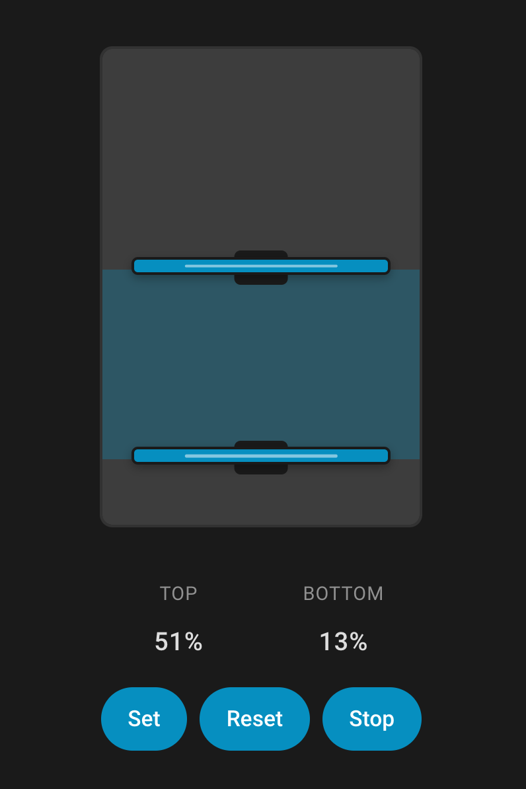

# Dual Cover Card

A Home Assistant Lovelace card with a vertical slider and **two handles** to control two `cover` entities independently (e.g., top + bottom shades).

## Installation

### Option A: HACS (recommended)

1. In Home Assistant, open **HACS** → **Frontend**.
2. Open the menu (⋮) → **Custom repositories**.
3. Add the GitHub repo URL (for example: `https://github.com/sagargp/dual-cover-card`) with category **Lovelace**.
4. Search for **Dual Cover Card** in HACS → install.
5. Restart Home Assistant (or at least reload the browser / clear cache).

### Option B: Manual

1. Download `dual-cover-card.js` from this repository.
2. Copy it to:
   - `/config/www/dual-cover-card.js`
3. Add it as a Lovelace resource:
   - **Settings** → **Dashboards** → **Resources** → **Add Resource**
   - URL: `/local/dual-cover-card.js`
   - Type: `JavaScript Module`

## Usage

Add the resource (HACS usually does this automatically), then add the card:

```yaml
type: custom:dual-cover-card
top_cover: cover.top_shade
bottom_cover: cover.bottom_shade
name: Dual Cover
```

## Examples

### Window (wide slider, no card background, manual set + stop)

```yaml
type: custom:dual-cover-card
top_cover: cover.office_shades_top
bottom_cover: cover.office_shades_bottom
name: Window
top_label: ""
bottom_label: ""
width: 200
show_background: false
show_slider_background: true
show_title: false
show_info: true
set_on_release: false
show_stop: true
```



## Configuration

| Key | Type | Default | Description |
| --- | --- | --- | --- |
| `top_cover` | string | **required** | Entity ID for the top cover (`cover.*`). |
| `bottom_cover` | string | **required** | Entity ID for the bottom cover (`cover.*`). |
| `name` | string | `"Dual Cover"` | Card title text (when `show_title: true`). |
| `top_label` | string | `"Top"` | Label under the slider for the top cover value. |
| `bottom_label` | string | `"Bottom"` | Label under the slider for the bottom cover value. |
| `width` | number | `56` | Slider width (px). Widen to simulate a wider window. |
| `show_title` | boolean | `true` | Show/hide the card header. |
| `show_background` | boolean | `true` | Show/hide the **ha-card** background. |
| `show_info` | boolean | `true` | Show/hide the two % readouts under the slider. |
| `set_on_release` | boolean | `true` | When true, service calls happen immediately on drag release. When false, drag updates are “pending” until pressing **Set**, and can be discarded with **Reset**. |
| `show_stop` | boolean | `false` | Show a **Stop** button to call `cover.stop_cover` for both entities. |

## Notes

- This card expects each `cover` entity to expose `attributes.current_position` (typical for position-capable covers).
- The card tries to show a busy spinner while covers are moving; it uses HA state, position deltas, and “commanded motion” tracking.
- This project was **vibe coded**.

## Support / Issues

Please open an issue in this repo with:
- Your card YAML
- The two cover entities’ state + attributes (Developer Tools → States)
- Home Assistant version


